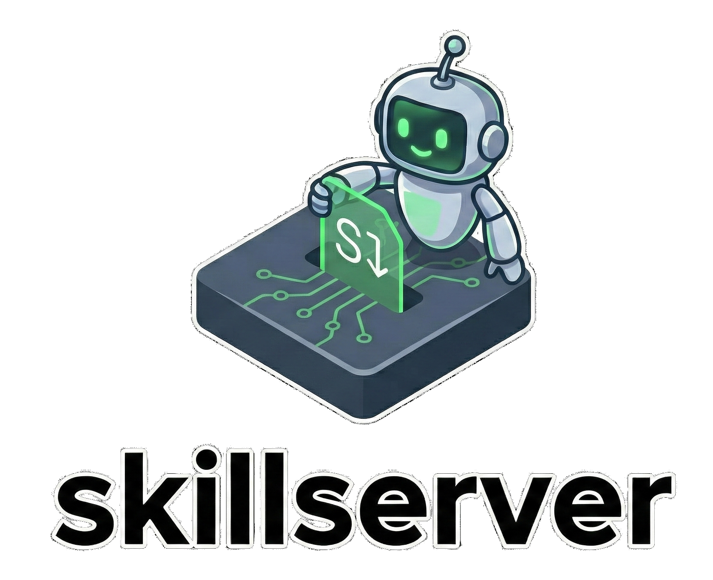

<div align="center">
  
</div>

# skillserver

An MCP/REST server with WebUI serving as a centralized skills database for AI Agents. It manages "Skills" (directory-based with SKILL.md files) stored in a local directory, following the [Agent Skills specification](https://agentskills.io).

## Features

- **MCP Server**: Provides tools for AI agents to list, search, read skills, and access skill resources
- **Web Interface**: Local web UI for creating, editing, and organizing skills with resource management
- **Git Synchronization**: Automatically syncs with Git repositories (skills from repos are read-only)
- **Full-Text Search**: Powered by Bleve for fast skill searching
- **Resource Management**: Support for scripts, references, and assets directories per skill
- **Agent Skills Spec Compliant**: Full support for the Agent Skills specification format

## Installation

### From Source

```bash
git clone https://github.com/mudler/skillserver
cd skillserver
make build
```

### Using Docker

```bash
docker pull ghcr.io/mudler/skillserver:latest
```

## Configuration

SkillServer supports both **environment variables** and **command-line flags**. Flags take precedence over environment variables.

### Environment Variables

| Variable | Alternative | Default | Description |
|----------|-------------|---------|-------------|
| `SKILLSERVER_DIR` | `SKILLS_DIR` | `./skills` | Directory to store skills |
| `SKILLSERVER_PORT` | `PORT` | `8080` | Port for the web server |
| `SKILLSERVER_GIT_REPOS` | `GIT_REPOS` | (empty) | Comma-separated Git repository URLs |
| `SKILLSERVER_ENABLE_LOGGING` | (none) | `false` | Enable logging to stderr (default: false to avoid interfering with MCP stdio) |

### Command-Line Flags

| Flag | Description |
|------|-------------|
| `--dir` | Directory to store skills (overrides `SKILLSERVER_DIR` or `SKILLS_DIR`) |
| `--port` | Port for the web server (overrides `SKILLSERVER_PORT` or `PORT`) |
| `--git-repos` | Comma-separated list of Git repository URLs (overrides `SKILLSERVER_GIT_REPOS` or `GIT_REPOS`) |
| `--enable-logging` | Enable logging to stderr (overrides `SKILLSERVER_ENABLE_LOGGING`). Default: false (disabled to avoid interfering with MCP stdio protocol) |

## Usage

### Basic Usage

```bash
# Using defaults
./skillserver

# Using environment variables
export SKILLSERVER_DIR=/path/to/skills
export SKILLSERVER_PORT=9090
./skillserver

# Using command-line flags
./skillserver --dir /path/to/skills --port 9090

# Using both (flags override env vars)
export SKILLSERVER_PORT=8080
./skillserver --port 9090  # Will use 9090

# Enable logging (useful for debugging, but disabled by default to avoid interfering with MCP stdio)
./skillserver --enable-logging
# Or using environment variable
export SKILLSERVER_ENABLE_LOGGING=true
./skillserver
```

### With Git Synchronization

```bash
# Using environment variable
export SKILLSERVER_GIT_REPOS="https://github.com/user/repo1.git,https://github.com/user/repo2.git"
./skillserver

# Using command-line flag
./skillserver --git-repos "https://github.com/user/repo1.git,https://github.com/user/repo2.git"
```

### Docker Usage

```bash
# Using environment variables
docker run -p 8080:8080 \
  -e SKILLSERVER_DIR=/app/skills \
  -e SKILLSERVER_PORT=8080 \
  -e SKILLSERVER_GIT_REPOS="https://github.com/user/repo.git" \
  -v $(pwd)/skills:/app/skills \
  ghcr.io/mudler/skillserver:latest

# Using command-line flags
docker run -p 8080:8080 \
  -v $(pwd)/skills:/app/skills \
  ghcr.io/mudler/skillserver:latest \
  --dir /app/skills --port 8080 --git-repos "https://github.com/user/repo.git"
```

## MCP Client Configuration

SkillServer runs as an MCP server over stdio, making it compatible with any MCP client. Here are configuration examples for popular clients:

**Note:** When using SkillServer as an MCP server, logging is disabled by default to avoid interfering with the stdio protocol. Enable it only for debugging purposes.

### [Wiz](https://github.com/mudler/wiz)

Add SkillServer to your Wiz configuration file (typically `~/.config/wiz/config.yaml` or similar):

```yaml
mcp_servers:
  skillserver:
    command: docker
    args:
      - "run"
      - "-i"
      - "--rm"
      - "-v"
      - "/host/path/to/skills:/app/skills"
      - "ghcr.io/mudler/skillserver:latest"
    env:
      SKILLSERVER_DIR: "/app/skills"
      SKILLSERVER_PORT: "9090"
      # Optional: Git repositories to sync
      # SKILLSERVER_GIT_REPOS: "https://github.com/user/repo.git"
      # Enable logging for debugging (default: false, disabled to avoid interfering with MCP stdio)
      # SKILLSERVER_ENABLE_LOGGING: "true"
```

### [LocalAI](https://github.com/mudler/LocalAI)

Add SkillServer to your LocalAI MCP configuration (typically in your LocalAI model config file):

```yaml
mcp:
  stdio: |
    {
      "mcpServers": {
        "skillserver": {
          "command": "docker",
          "args": [
            "run", "-i", "--rm",
            "-v", "/host/path/to/skills:/app/skills",
            "-e", "SKILLSERVER_DIR=/app/skills",
            "-e", "SKILLSERVER_PORT=9090",
            "ghcr.io/mudler/skillserver:latest"
          ]
        }
      }
    }
```

With Git synchronization:

```yaml
mcp:
  stdio: |
    {
      "mcpServers": {
        "skillserver": {
          "command": "docker",
          "env": {
            "SKILLSERVER_DIR": "/app/skills",
            "SKILLSERVER_PORT": "9090",
            "SKILLSERVER_GIT_REPOS": "https://github.com/user/repo.git"
          },
          "args": [
            "run", "-i", "--rm",
            "-v", "/host/path/to/skills:/app/skills",
            "-e", "SKILLSERVER_DIR",
            "-e", "SKILLSERVER_PORT",
            "-e", "SKILLSERVER_GIT_REPOS",
            "ghcr.io/mudler/skillserver:latest"
          ]
        }
      }
    }
```

### Claude Desktop

Add SkillServer to your Claude Desktop MCP configuration (typically `~/Library/Application Support/Claude/claude_desktop_config.json` on macOS or `%APPDATA%\Claude\claude_desktop_config.json` on Windows):

```json
{
  "mcpServers": {
    "skillserver": {
      "command": "docker",
      "args": [
        "run", "-i", "--rm",
        "-v", "/host/path/to/skills:/app/skills",
        "ghcr.io/mudler/skillserver:latest"
      ],
      "env": {
        "SKILLSERVER_DIR": "/app/skills",
        "SKILLSERVER_PORT": "9090",
        "SKILLSERVER_GIT_REPOS": "https://github.com/user/repo.git"
      }
    }
  }
}
```

### Cline / Other MCP Clients

Most MCP clients support stdio-based servers. Configure SkillServer using Docker:

```yaml
# Generic MCP client configuration
mcp_servers:
  skillserver:
    command: docker
    args:
      - "run"
      - "-i"
      - "--rm"
      - "-v"
      - "/host/path/to/skills:/app/skills"
      - "ghcr.io/mudler/skillserver:latest"
    env:
      SKILLSERVER_DIR: "/app/skills"
      SKILLSERVER_PORT: "9090"
```

**Using the binary directly** (if you prefer not to use Docker):

```yaml
mcp_servers:
  skillserver:
    command: /path/to/skillserver
    args: []  # Optional command-line arguments
    env:      # Optional environment variables
      SKILLSERVER_DIR: "/path/to/skills"
      SKILLSERVER_PORT: "9090"
```

## Skill Format

Skills follow the [Agent Skills specification](https://agentskills.io). Each skill is a directory containing:

- **SKILL.md** (required): Markdown file with YAML frontmatter containing:
  - `name` (required): Skill name matching directory name
  - `description` (required): Description of what the skill does
  - `license` (optional): License information
  - `compatibility` (optional): Environment requirements
  - `metadata` (optional): Additional metadata
  - `allowed-tools` (optional): Pre-approved tools

- **scripts/** (optional): Executable code (Python, Bash, JavaScript, etc.)
- **references/** (optional): Additional documentation files
- **assets/** (optional): Static resources (templates, images, data files)

Example structure:
```
my-skill/
├── SKILL.md
├── scripts/
│   └── process.py
├── references/
│   └── API.md
└── assets/
    └── template.docx
```

## API Endpoints

### REST API

#### Skills
- `GET /api/skills` - List all skills (local and from git repos)
- `GET /api/skills/:name` - Get skill content
- `POST /api/skills` - Create new skill
- `PUT /api/skills/:name` - Update skill (blocks read-only skills)
- `DELETE /api/skills/:name` - Delete skill (blocks read-only skills)
- `GET /api/skills/search?q=query` - Search skills

#### Resources
- `GET /api/skills/:name/resources` - List all resources (scripts, references, assets)
- `GET /api/skills/:name/resources/*` - Get/download a resource file
- `POST /api/skills/:name/resources` - Upload/create a resource (multipart/form-data or JSON)
- `PUT /api/skills/:name/resources/*` - Update a resource file
- `DELETE /api/skills/:name/resources/*` - Delete a resource

### MCP Tools

#### Skills
- `list_skills` - List all available skills (returns skill IDs for use with read_skill)
- `read_skill` - Read the full content of a skill by its ID
- `search_skills` - Search for skills by query string

#### Resources
- `list_skill_resources` - List all resources (scripts, references, assets) in a skill
- `read_skill_resource` - Read the content of a resource file (UTF-8 for text, base64 for binary, max 1MB)
- `get_skill_resource_info` - Get metadata about a resource without reading content

## Web Interface

The web UI provides a user-friendly interface for managing skills:

### Skill Management
- **Create Skills**: Create new skills with proper frontmatter validation
- **Edit Skills**: Edit skill content and metadata (read-only for git repo skills)
- **Delete Skills**: Delete local skills (read-only skills cannot be deleted)
- **Search**: Full-text search across all skills

### Resource Management
- **Upload Resources**: Upload files to scripts/, references/, or assets/ directories
- **View Resources**: Click text files to view/edit, binary files to download
- **Edit Resources**: Edit text-based resources (scripts, markdown references)
- **Delete Resources**: Remove resources from skills (read-only skills protected)

### Features
- **Read-Only Indicators**: Skills from git repositories are clearly marked and protected
- **Real-time Validation**: Skill name validation according to Agent Skills spec
- **Resource Browser**: Organized view of scripts, references, and assets per skill
- **Tabbed Interface**: Switch between skill content and resources

Access the web UI at `http://localhost:8080` (or your configured port).

## Development

### Building

```bash
make build
```

### Testing

```bash
make test
```

### Running

```bash
make run
```

### Docker Build

```bash
make docker-build
```

## License

MIT
